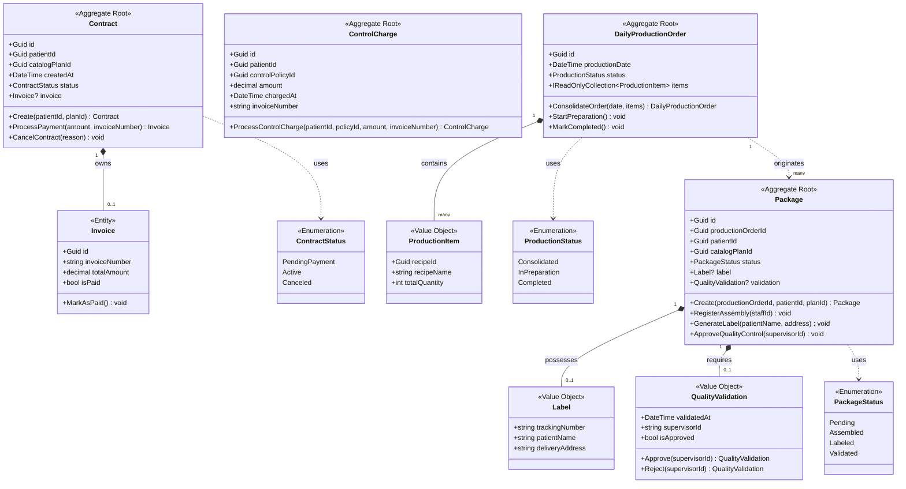

# Nurtricenter MS3 — Contracting & Production

## 1. Descripción del Microservicio

**MS3 — Contracting & Production** es el microservicio encargado de la contratación de planes alimenticios, la facturación/cobranza y la gestión de producción diaria y empaquetado dentro del ecosistema Nurtricenter.

### Propósito

Gestionar el ciclo completo desde que un paciente selecciona un plan hasta que su paquete de alimentos sale validado hacia logística.

### Funcionalidades

| Contexto | Funcionalidad | Endpoint |
|----------|--------------|----------|
| **Contratos** | Crear contrato entre paciente y plan | `POST /api/v1/contracts` |
| | Consultar contrato por ID | `GET /api/v1/contracts/{id}` |
| | Cancelar contrato activo | `PUT /api/v1/contracts/{id}/cancel` |
| **Facturación** | Cobrar plan contratado | `POST /api/v1/billing/charge-plan` |
| | Consultar factura | `GET /api/v1/billing/{invoiceNumber}` |
| | Cobrar control de seguimiento (sin plan) | `POST /api/v1/billing/charge-control` |
| **Producción** | Generar orden de producción diaria | `GET /api/v1/production/daily-order` |
| | Crear paquete de entrega | `POST /api/v1/production/packages` |
| | Registrar armado de paquete | `POST /api/v1/production/packages/assemble` |
| | Generar etiqueta de envío | `POST /api/v1/production/packages/label` |
| | Validar paquete (control de calidad) | `POST /api/v1/production/packages/validate` |
| **Simulación** | Endpoints auxiliares para MS1/MS2/MS4/MS5 | `/api/v1/sim/*` |
| **Salud** | Health check | `GET /health` |

### Dependencias Inter-MS (Simuladas)

| Origen | Destino | Propósito | Endpoint Sim |
|--------|---------|-----------|-------------|
| MS3 | MS1 | Validar paciente y obtener nombre | `GET /api/v1/sim/patients/{id}` |
| MS3 | MS2 | Validar plan y obtener costo | `GET /api/v1/sim/catalog/plans/{id}` |
| MS3 | MS2 | Obtener estructura de recetas (batch) | `POST /api/v1/sim/catalog/plans/structure` |
| MS3 | MS4 | Obtener calendarios activos (mañana) | `GET /api/v1/sim/calendars/active-tomorrow` |
| MS3 → | MS4 | Evento: crear calendario post-pago | `GET /api/v1/sim/outgoing/CreateSchedule` |
| MS3 → | MS5 | Evento: transferir paquetes validados | `GET /api/v1/sim/outgoing/TransferToLogistics` |

### Tecnologías

- .NET 8, FastEndpoints, MediatR, Entity Framework Core, PostgreSQL
- Arquitectura: Domain-Driven Design + Clean Architecture + CQRS

---

## 2. Diagrama de Clases del Dominio (MS3)



### Leyenda

| Color/Símbolo | Significado |
|--------------|-------------|
| `<<Aggregate Root>>` | Raíz de agregado — entrada única al cluster de objetos |
| `<<Entity>>` | Entidad con identidad propia |
| `<<Value Object>>` | Objeto sin identidad, comparado por valor |
| `<<Enumeration>>` | Tipo enumerado con estados fijos |
| `*--` | Composición (owned) |
| `..>` | Dependencia / uso |

### Estructura del Proyecto

```
Nurtricenter/
├── Nurtricenter.MS3.Core/           # Capa de Dominio
│   ├── Aggregates/                   # Contract, ControlCharge, DailyProductionOrder, Package
│   ├── Entities/                     # Invoice
│   ├── ValueObjects/                 # ProductionItem, Label, QualityValidation
│   ├── Enums/                        # ContractStatus, ProductionStatus, PackageStatus
│   ├── DomainEvents/                 # ContractCreated, ContractActivated, ContractCanceled
│   ├── Common/                       # ValueObject base class
│   └── Simulations/                  # OutgoingIntegrationEvent
│
├── Nurtricenter.MS3.Application/    # Capa de Aplicación
│   ├── Commands/                     # CQRS Commands
│   ├── Handlers/                     # Command/Query Handlers (MediatR)
│   ├── Queries/                      # CQRS Queries
│   ├── Interfaces/                   # Repository + UnitOfWork interfaces
│   ├── Dtos/                         # Request/Response DTOs
│   └── Simulations/                  # ISimulationService + mock data
│
├── Nurtricenter.MS3.Infrastructure/ # Capa de Infraestructura
│   ├── Data/
│   │   ├── ApplicationDbContext.cs
│   │   ├── Configurations/           # EF Core IEntityTypeConfiguration
│   │   ├── Migrations/
│   │   └── DatabaseSeeder.cs
│   └── Repositories/                 # Implementaciones de repositorios + UnitOfWork
│
├── Nurtricenter.Api/                # Capa de Presentación
│   ├── Endpoints/                    # FastEndpoints por contexto
│   │   ├── Contracts/
│   │   ├── Billing/
│   │   ├── Production/
│   │   └── Simulations/
│   ├── Program.cs
│   └── appsettings.json
│
└── docs/
    └── HAPPY_PATH.md                 # Guía de flujo happy path
```
